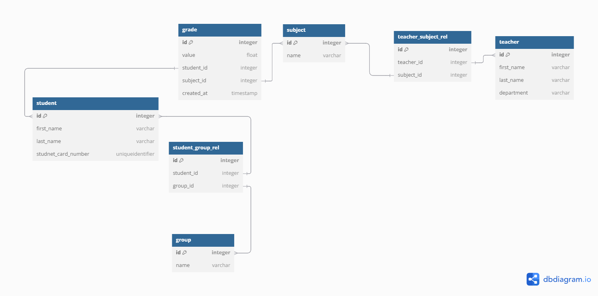

# goit-pythonweb-hw-06

Diagram scheme:



Database configuration:

```
echo "POSTGRES_PASSWORD=mysecretpassword" > .env
```

For Windows Powershell set:

```
$env:POSTGRES_PASSWORD="mysecretpassword"
```

## CLI Usage

**Create new object in DB**

```
python main.py -a create -m teacher first_name=Python last_name=Go

```

Output:

```
2025-03-24 18:20:42,931 INFO Query successded return result <models.Teacher object at 0x00000216A4B0FED0>

```

**List objects**

```
python main.py -a list -m teacher
```

Output :

```
2025-03-24 18:24:59,559 INFO Query successded return result [(1, 'Lori', 'Clark'), (2, 'Kendra', 'Kane'), (3, 'Ryan', 'Woods'), (4, 'Zachary', 'Middleton'), (5, 'Linda', 'Shaw'), (6, 'Raymond', 'Davila'), (7, 'Boris', 'Jonnson'), (8, 'Boris', 'Jonnson'), (10, 'Boris', 'Jonnsons'), (11, 'Boris', 'Jonnsons'), (12, 'Python', 'Go'), (13, 'Python', 'Go'), (14, 'Python', 'Go'), (15, 'Python', 'Go')]
```

**Update object**

```
python main.py -a upd -m teacher -i 15 first_name=C++
```

Output :

```
2025-03-24 18:26:23,183 INFO Query successded return result <models.Teacher object at 0x0000016D92905350>
```

Re-check changes:

```
python main.py -a list -m teacher
```

```
2025-03-24 18:26:25,717 INFO Query successded return result [(1, 'Lori', 'Clark'), (2, 'Kendra', 'Kane'), (3, 'Ryan', 'Woods'), (4, 'Zachary', 'Middleton'), (5, 'Linda', 'Shaw'), (6, 'Raymond', 'Davila'), (7, 'Boris', 'Jonnson'), (8, 'Boris', 'Jonnson'), (10, 'Boris', 'Jonnsons'), (11, 'Boris', 'Jonnsons'), (12, 'Python', 'Go'), (13, 'Python', 'Go'), (14, 'Python', 'Go'), (15, 'C++', 'Go')]

```

**Delete object in DB**

```
python main.py -a rm -m teacher -i 15
```

Output:

```
2025-03-24 18:27:39,977 INFO Deleted object in DB
```

Re-check changes:

```
 python main.py -a list -m teacher
```

Output:

```
2025-03-24 18:27:50,410 INFO Query successded return result [(1, 'Lori', 'Clark'), (2, 'Kendra', 'Kane'), (3, 'Ryan', 'Woods'), (4, 'Zachary', 'Middleton'), (5, 'Linda', 'Shaw'), (6, 'Raymond', 'Davila'), (7, 'Boris', 'Jonnson'), (8, 'Boris', 'Jonnson'), (10, 'Boris', 'Jonnsons'), (11, 'Boris', 'Jonnsons'), (12, 'Python', 'Go'), (13, 'Python', 'Go'), (14, 'Python', 'Go')]
```

**List filtering examples**

- _Specify the object id_

```
python main.py -a list -m teacher id=14
```

- _Filter by other filed_

```
python main.py -a list -m teacher first_name=Python
```

- _Specify the columns output_

```
python main.py -a list -m teacher -c first_name,last_name,id,department id=1
```
